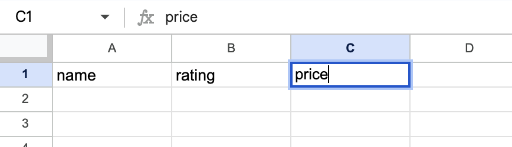
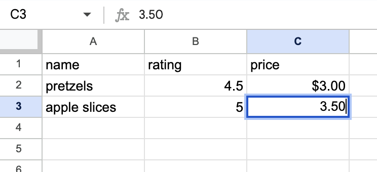
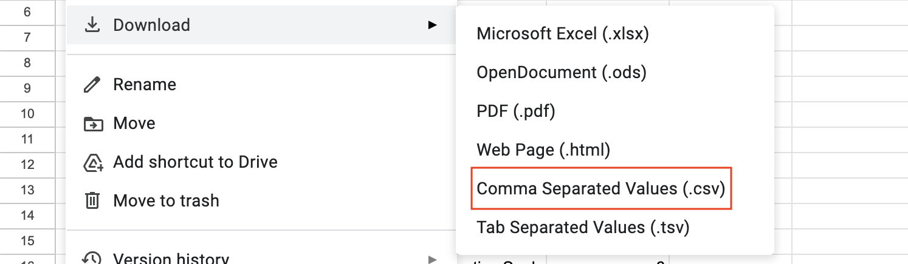
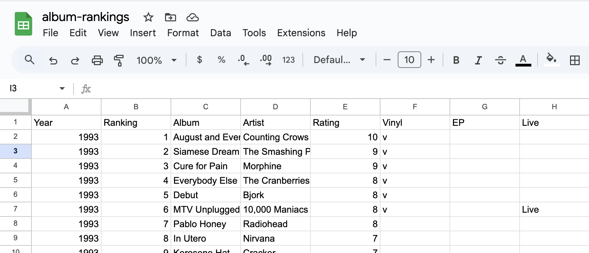

# Working with .csv files

MyFavoriteAlbums stores its data in .csv files. These documents will help teach you 
the basics of using .csv files, so you can personalize the existing data, 
or even add additional datasets to be analyzed by the software. 

If you only want to modify the existing dataset to contain your own music tastes, you should edit the .csv file locally. 
If you want to add additional datasets for analysis, you should create new .csv files.

#### In this document
  * [Creating .csv files](###creating-.csv-files)
  * [Editing .csv files](###editing-.csv-files-locally)

### Creating .csv files
Google Sheets and Excel are both excellent tools that can create .csv files. This document will show you how to create a .csv file.
  1. Create a new spreadsheet
  2. In the topmost row of the spreadsheet, add labels of the features you want to store data of. For example, if you want to store the name, rating, and price of your favorite snacks, your first three columns should say ```name```, ```rating```, and ```price```.
     
  3. Each of the following rows of the spreadsheet should represent one datapoint (e.g. one favorite snack). Fill out the rest of the table with your data, making sure to match the info in each column to the labels in the topmost row.
     
  4. Once you are done adding data, download the file as a .csv file, and use it in MyFavoriteAlbums.
     


### Editing .csv files locally
Google Sheets and Excel are both excellent tools that are commonly used to edit .csv files. This tutorial will go over how to edit .csv files with these softwares.
  1. Open the .csv file you want to edit with either Google Sheets or Excel. The topmost row in the file contains the aspects of data being recorded. Each row represents one datapoint.
     
  2. Delete any rows below the first row that you don’t want in your dataset. Add your own music preferences in, making sure to put each piece of information in the relevant column.
  3. Once you are done modifying the data, save the file. It is now ready to be analyzed by MyFavoriteAlbums.


### Related resources:
  * [What are .csv files?](csvwhatis.md)
