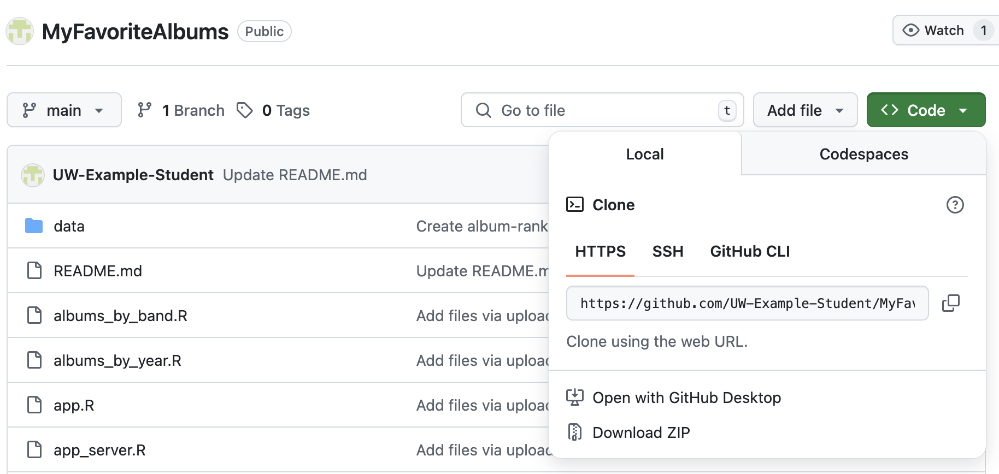

# Working with GitHub

GitHub is a popular version control system (a tool that allows developers to track changes to code and documents over time).
If you’d like to create your own copy of the MyFavoriteAlbums code to tinker with, you can either download 
the files locally or fork the repository.

If you’d just like to check out MyFavoriteAlbums on your own, downloading the files onto your 
local device is sufficient. On the other hand, you should fork the repository if you are interested 
in storing your own personal version of the source code on GitHub or further developing the analysis features. 

###  Downloading MyFavoriteAlbums source code from GitHub

  1. Navigate to the [MyFavoriteAlbums GitHub repository](https://github.com/UW-Example-Student/MyFavoriteAlbums?tab=readme-ov-file).
  2. Above the list of files, and below the title of the repository, click **Code**, then **Download Zip**.
     
A zip file is downloaded onto your computer. You can now run or edit the code locally,
and any changes you make won’t modify the MyFavoriteAlbums repository on GitHub.

### Related resources:
  * [How to fork a repository](https://docs.github.com/en/pull-requests/collaborating-with-pull-requests/working-with-forks/fork-a-repo)
