# Navigating through MyFavoriteAlbums

MyFavoriteAlbums is a web app that allows users to analyze their music data. 
This document will introduce you to the user interface and provided features.

MyFavoriteAlbums has separate tabs for comparing ratings between artists,
finding top albums by year, finding average and total ratings by artist, finding #1 albums
by year range, and getting info on vinyls you own.

#### In this document:
  * [Comparing ratings between artists](###comparing-ratings-between-artists)
  * [Finding top albums by year](###finding-top-albums-by-year)
  * [Finding average and total ratings by artist](###finding-average-and-total-ratings-by-artist)
  * [Finding #1 albums by year range](###finding-number-1-albums-by-year-range)
  * [Finding vinyl statistics](###finding-vinyl-statistics)

### Comparing ratings between artists
[Back to the top](####in-this-document)
  1. Click on the **Band Comparison** tab.
     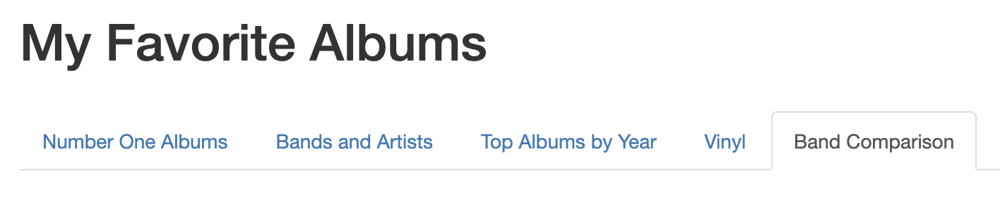
  2. Click on the dropdown menu under **First band or artist:**.
  3. Scroll, or alternatively type in an artist’s name, then click on the first artist you want to compare.
     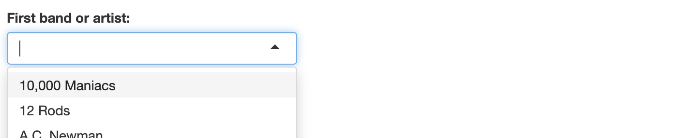
  4. Click on the dropdown menu under **Second band or artist:**.
  5. Scroll, or alternatively, type in an artist’s name, then click on the second artist you want to compare.
     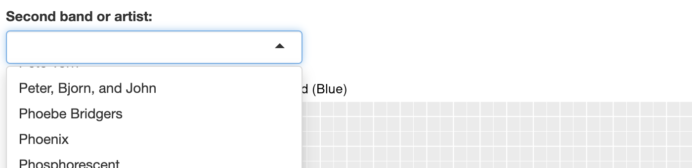

The **Albums Ratings** graph updates to include data points from each selected artist.
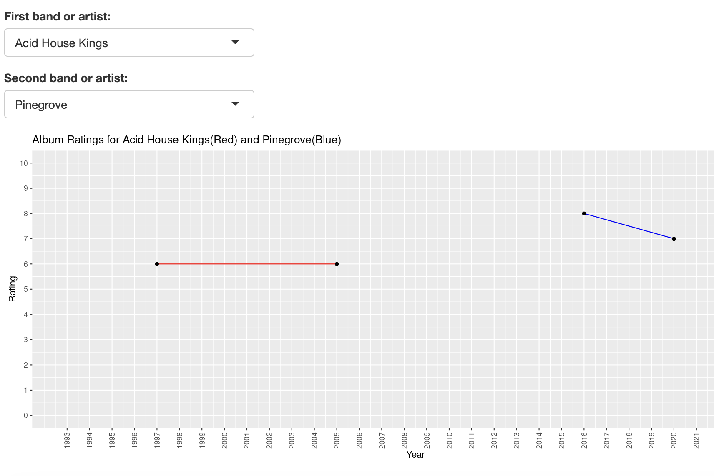

### Finding top albums by year
[Back to the top](####in-this-document)
  1. Click on the **Top Albums by Year** tab.
     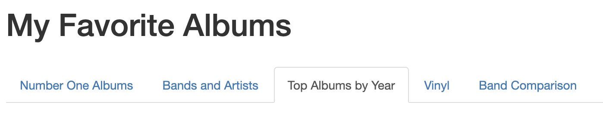
  2. Click on the dropdown menu under **Choose a year:**.
  3. Scroll, or alternatively type in a year, then click on the year you want to search.
     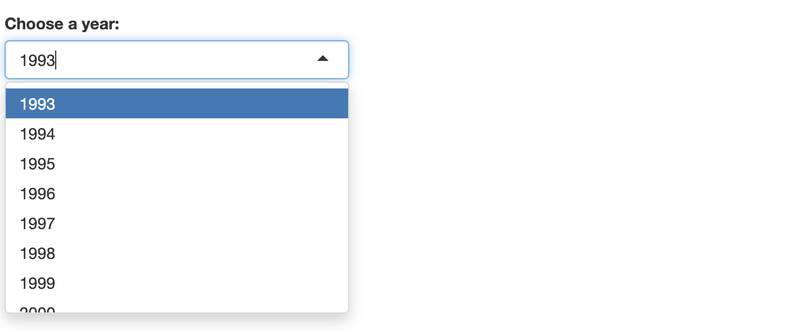
  4.Click the **Submit** button.

A table appears, containing columns for the **Ranking**, **Album**, and **Artist** of all albums released in the selected year.
The table is sorted in descending order based on ranking. 
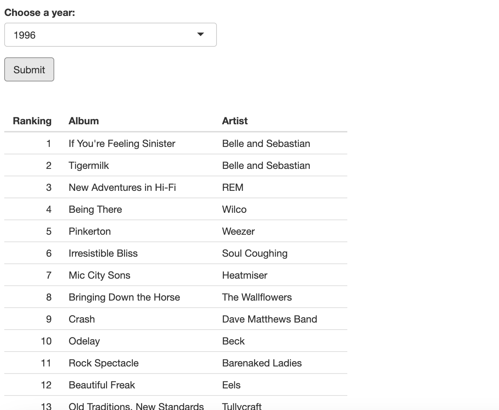

### Finding average and total ratings by artist
[Back to the top](####in-this-document)
  1. Click on the **Bands and Artists** tab.
     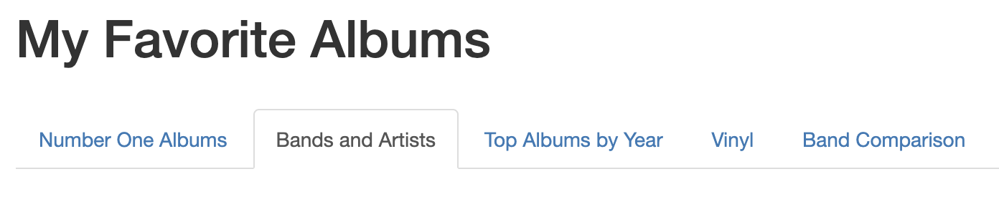
  2. Click on the dropdown menu under **Choose a band or artist:**.
  3. Scroll, or alternatively type in an artist, then click on the artist you want to search for.
     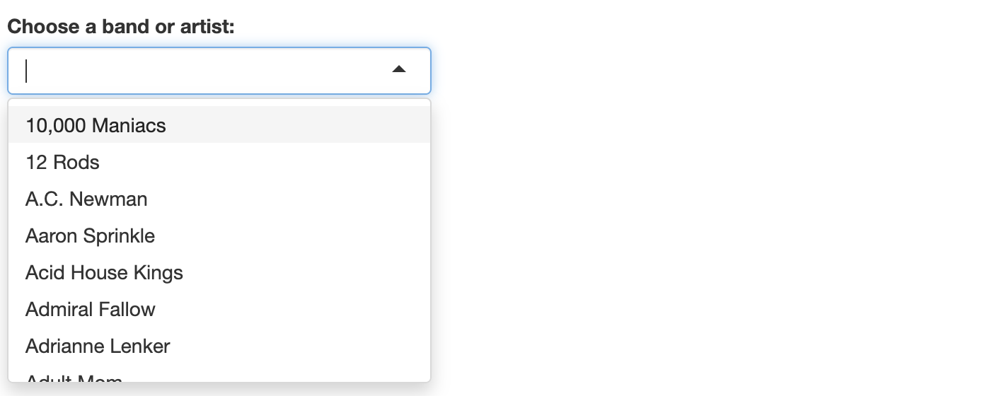
  4.Click the **Submit** button.

A table appears, containing columns for the **Ranking**, **Album**, and **Year** of all albums by the selected artist
in the dataset, as well as that artist’s cumulative statistics. 
The table is sorted in ascending order based on album release date. Scroll down to view more albums from that artist.
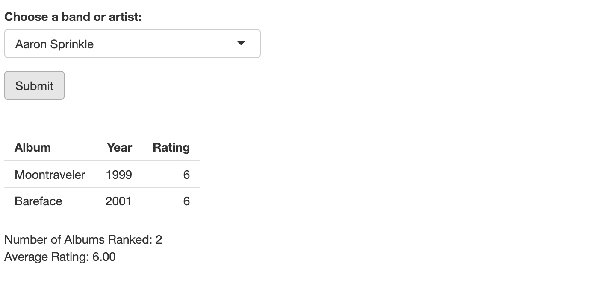

### Finding number 1 albums by year range
[Back to the top](####in-this-document)
  1. Click on the **Number One Album**s tab.
     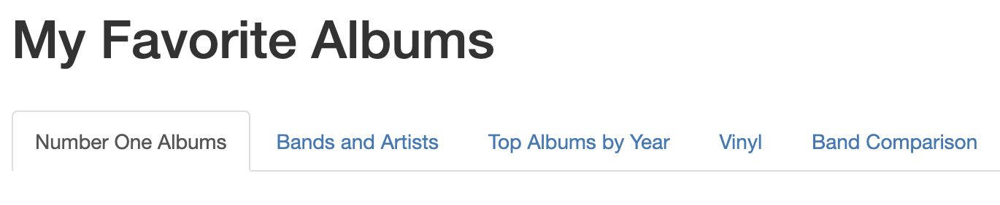
     A number line with a slider appears on the screen, with a table containing albums in the chosen timeframe underneath.
  2. To adjust the range of years, click and drag on one end of the slider. The table updates when the slider is released.
     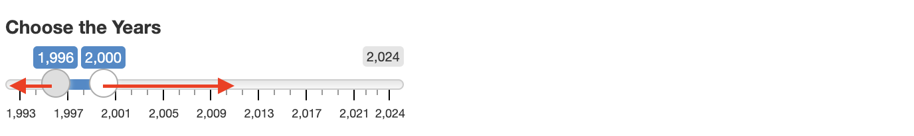

### Finding vinyl statistics
[Back to the top](####in-this-document)
  1. Click on the **Vinyl** tab.
     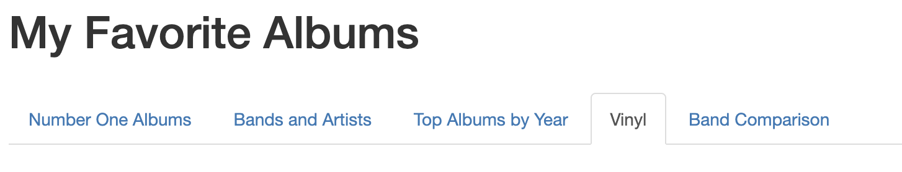
Two tables appear; with **Top-rated vinyl that I don't own** appearing above **Years for which I own the most vinyl**.
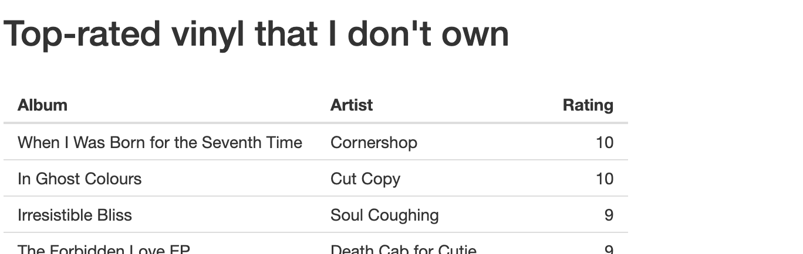
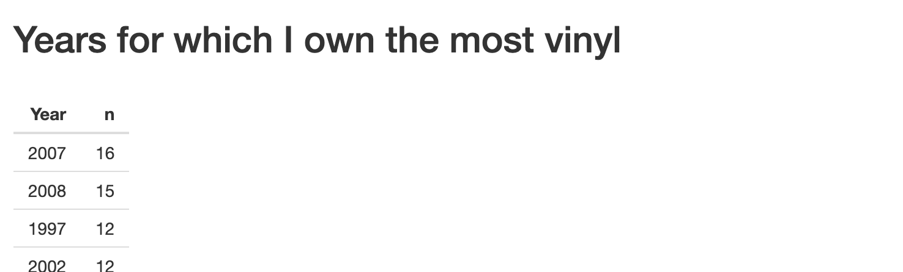
